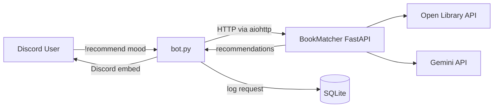

# Book Mood Bot

A Discord bot that recommends real books based on your mood, built on top of [BookMatcher](https://github.com/MaccSob/BookMatcher) — a RAG pipeline that pairs live Open Library data with Gemini LLM reasoning.

Instead of asking an LLM to invent book titles, this bot retrieves real candidates from Open Library first, then uses an LLM only to interpret your mood and explain why each match fits. This bot is a second front-end for that same pipeline — the first being BookMatcher's own web frontend.

## How it works

1. A user runs `!recommend <mood>` in Discord, e.g. `!recommend something light before bed, 30 minutes max`.
2. The bot sends the mood to BookMatcher's FastAPI service (`POST /recommend`) over HTTP.
3. The API interprets the mood, searches Open Library for candidates, and asks Gemini to rank and explain the best matches.
4. The bot posts each recommendation back into the channel as a Discord embed — title, author, and reasoning.
5. Every recommendation is logged to a local SQLite database, tied to the Discord user who requested it.

## Architecture



## Status

**Complete (v1).**

- [x] `!recommend` command wired to the BookMatcher API over HTTP
- [x] Discord embed formatting for results (title, author, reasoning)
- [x] Configurable API URL and Discord token via `.env`
- [x] Mock-data mode for developing/testing without hitting Open Library
- [x] Per-user recommendation history, stored in SQLite

**Possible future extensions:**

- Use stored history to avoid repeat recommendations
- 👍/👎 feedback on recommendations, stored for future ranking
- Scheduled "Book of the Day" post

## Project structure

```
book-mood-bot/
├── bot.py              # Bot entry point, command registration
├── api.py              # FastAPI service (from BookMatcher)
├── main.py             # Recommendation pipeline entry point
├── books.py            # Open Library search + details, with mock-data toggle
├── llm.py              # Mood interpretation + ranking via Gemini
├── db.py               # SQLite setup and recommendation history storage
├── mock_data.py        # Fake Open Library responses for offline dev
├── .env.example         # Template for required environment variables
├── .gitignore
└── requirements.txt
```

## Tech stack

- Python, `discord.py` for the bot
- FastAPI for the recommendation API (from BookMatcher)
- `aiohttp` — async HTTP calls from the bot to the API
- `sqlite3` (Python standard library) — per-user recommendation history
- `requests`, `google-genai`, `pydantic` — BookMatcher's own pipeline
- `python-dotenv` — config/secrets management

## Setup

```
python -m venv venv
source venv/bin/activate  # Windows: venv\Scripts\activate
pip install -r requirements.txt
cp .env.example .env
```

Then fill in `.env` with your own values:

```
DISCORD_TOKEN=your_discord_bot_token
GEMINI_API_KEY=your_gemini_api_key
API_URL=http://127.0.0.1:8000/recommend
USE_MOCK_DATA=false
```

## Running the bot

Two processes need to run at once, in separate terminals:

```
uvicorn api:app --reload
```

```
python bot.py
```

Once both are running, the bot appears online in any server it's been invited to, and responds to `!recommend <mood>` with book suggestions. A `bookbot.db` SQLite file is created automatically on first run to store recommendation history.

### Mock mode

Set `USE_MOCK_DATA=true` in `.env` to skip real Open Library calls and use fixed sample data instead — useful for developing the bot itself without depending on external API reliability. Real Gemini ranking still runs on top of the mock candidates.

## Lessons learned

Getting from "imports the pipeline" to "actually works" surfaced a few real bugs worth noting:

- A module-level test script in `main.py` was re-running (and hitting the network) on every import, not just direct execution — fixed with an `if __name__ == "__main__":` guard.
- Open Library requests had no `User-Agent` header, which likely contributed to intermittent connection resets under a burst of ~20 requests — fixed by adding a descriptive header and a small delay between requests.
- Added a `USE_MOCK_DATA` toggle so bot development isn't blocked by external API flakiness going forward.
- Every module that reads an environment variable needs its own `load_dotenv()` call — it isn't shared automatically just because another file in the same run already called it.

## Related project

[BookMatcher](https://github.com/MaccSob/BookMatcher) — the underlying mood-based recommendation API this bot is built on.

## License

TBD
